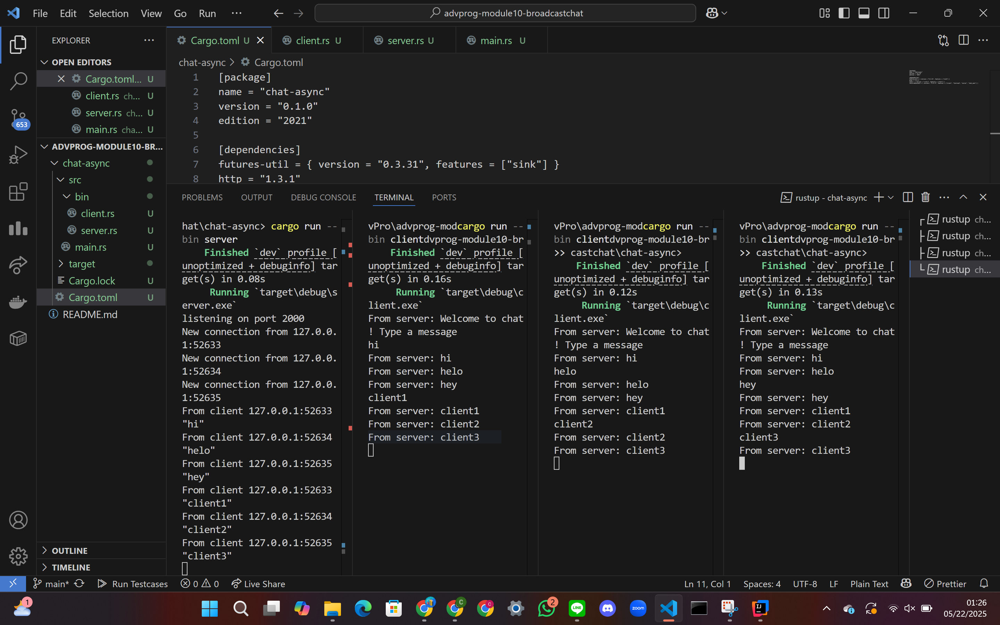

# advprog-module10-broadcastchat

### Tutorial 2.1

### How to Run:
1. Start the server: `cargo run --bin server`
2. Start 3 clients: `cargo run --bin client`

### What happens
When the server starts, it listens on `127.0.0.1:2000`.
- Each client connects to the server using WebSocket.
- Messages typed by one client are broadcast to all connected clients.
- The server handles multiple clients concurrently using async tasks.